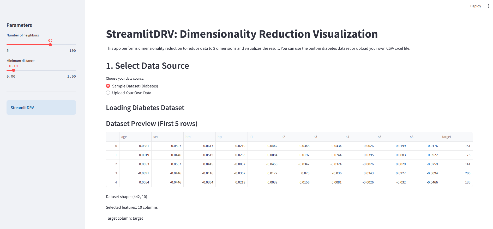

# StreamlitDRV - Dimensionality Reduction Visualization

*Course: Visualization of Large Datasets (Wizualizacja Dużych Zbiorów Danych) · AGH University of Kraków*

A comprehensive Streamlit application for interactive dimensionality reduction and data visualization. This tool allows users to explore various dimensionality reduction techniques with their own datasets or sample data, providing detailed analysis and parameter optimization capabilities.

PDF reports available in [`reports/`](reports/) — English and Polish versions:

- [English report](reports/report_en.pdf)
- [Polish report](reports/report_pl.pdf)



## Features

- **Multiple Dimensionality Reduction Methods**:

  - PCA (Principal Component Analysis)
  - Kernel PCA (with multiple kernels)
  - t-SNE (t-Distributed Stochastic Neighbor Embedding)
  - UMAP (Uniform Manifold Approximation and Projection)
  - TRIMAP (TriMap, optional - see Installation)
  - PaCMAP (Pairwise Controlled Manifold Approximation)

- **Data Input Options**:

  - Built-in diabetes dataset for quick testing
  - CSV/Excel file upload support
  - Automatic data validation and preprocessing

- **Interactive Analysis**:

  - Real-time parameter adjustment
  - Comprehensive metrics and quality analysis
  - Parameter optimization with heatmaps
  - Feature selection impact analysis

- **Professional Visualizations**:
  - Interactive 2D scatter plots
  - Variance analysis charts
  - Reconstruction error visualizations
  - Parameter optimization heatmaps

## Run using Docker

```bash
docker build -t streamlit-app .

docker run -d -p 8501:8501 streamlit-app
```

## Prerequisites

- Python 3.12 or higher
- [uv](https://docs.astral.sh/uv/) package manager (recommended) or pip

TRIMAP requires the optional dependency group `trimap`, which pulls in `annoy`. `annoy` has no prebuilt wheels for modern Python versions and is compiled during installation, so a C++ build toolchain is required:

- Windows: MSVC C++ Build Tools (workload "Desktop development with C++")
- macOS: Xcode Command Line Tools (`xcode-select --install`)
- Linux: `gcc` / `g++` (e.g. `apt install build-essential`)

Without this group, the app runs normally with TRIMAP hidden from the method list.

## Installation

### Option 1: Using uv (Recommended)

1. **Clone or download the project**:

   ```cmd
   git clone <repository-url>
   cd StreamlitDRV
   ```

   Or extract the project files to a directory.

2. **Install dependencies using uv**:

   ```cmd
   uv sync
   ```

   To include TRIMAP:

   ```cmd
   uv sync --extra trimap
   ```

3. **Activate the virtual environment** (if not automatically activated):
   ```cmd
   uv shell
   ```

### Option 2: Using pip

1. **Clone or download the project**:

   ```cmd
   git clone <repository-url>
   cd StreamlitDRV
   ```

2. **Create a virtual environment** (recommended):

   ```cmd
   python -m venv venv
   venv\Scripts\activate
   ```

3. **Install dependencies**:
   ```cmd
   pip install streamlit numpy pandas plotly scikit-learn umap-learn pacmap openpyxl seaborn
   ```

   TRIMAP (optional, requires a C++ compiler):
   ```cmd
   pip install trimap annoy
   ```

## Running the Application

### Using uv:

```cmd
uv run streamlit run app.py
```

### Using pip:

```cmd
streamlit run app.py
```

The application will open in your default web browser at `http://localhost:8501`.

## Usage Guide

### 1. **Data Selection**

- Choose between the built-in diabetes dataset or upload your own CSV/Excel file
- For custom datasets, select target and feature columns

### 2. **Data Preprocessing**

- Handle missing values automatically
- Data is automatically scaled using StandardScaler
- Option to limit sample size for large datasets

### 3. **Method Selection**

- Choose from 6 different dimensionality reduction methods
- Adjust method-specific parameters using the sidebar controls

### 4. **Analysis and Visualization**

- View 2D scatter plot of reduced data
- Explore detailed metrics and analysis
- Optimize parameters using heatmap visualizations

### 5. **Parameter Optimization**

- Automatic parameter grid search
- Quality metrics for different parameter combinations
- Visual heatmaps showing optimal parameter ranges

## Project Structure

```
StreamlitDRV/
├── app.py                          # Main application entry point
├── pyproject.toml                  # Project configuration and dependencies
├── uv.lock                         # Locked dependency versions
├── Dockerfile                      # Container build definition
├── .dockerignore                   # Docker build context exclusions
├── LICENSE                         # MIT license
├── README.md                       # This file
├── docs/                           # Screenshots and documentation assets
├── reports/                       # Compiled reports (PDF)
│   ├── report_en.pdf
│   └── report_pl.pdf
└── src/                           # Source code modules
    ├── __init__.py                # Package initialization
    ├── config.py                  # Configuration and constants
    ├── data_handler.py            # Data loading and preprocessing
    ├── reduction_methods.py       # Dimensionality reduction algorithms
    ├── visualizations.py          # Plotting and visualization functions
    ├── metrics.py                 # Quality metrics and evaluation
    └── parameter_optimization.py  # Grid search and parameter tuning
```

## Module Overview

- **`config.py`**: Page configuration, method descriptions, and constants
- **`data_handler.py`**: Data loading, validation, preprocessing, and sampling
- **`reduction_methods.py`**: Implementation of all dimensionality reduction algorithms
- **`visualizations.py`**: Interactive plots and visualization components
- **`metrics.py`**: Quality metrics, variance analysis, and evaluation functions
- **`parameter_optimization.py`**: Grid search and parameter optimization tools

## Supported Data Formats

- **CSV files** (`.csv`)
- **Excel files** (`.xlsx`, `.xls`)
- **Built-in datasets** (diabetes dataset included)

### Data Requirements:

- At least 2 numeric columns for dimensionality reduction
- Minimum 10 samples after preprocessing
- Target column for visualization coloring

## Method-Specific Guidelines

### PCA

- Use more components for higher accuracy but lower compression
- Consider data subset ratio for computational efficiency

### Kernel PCA

- RBF kernel works well for most datasets
- Higher gamma values capture more local patterns
- Polynomial kernel good for structured data

### t-SNE

- Lower perplexity for local structure, higher for global
- Higher learning rate for faster convergence
- Perplexity should be less than number of samples

### UMAP

- More neighbors preserve global structure
- Lower min_dist creates tighter clusters
- Good balance between local and global preservation

### TRIMAP

- Optional dependency group; requires a C++ build toolchain (see Prerequisites)
- More inliers preserve local neighborhoods
- More outliers help with global structure

### PaCMAP

- Balance MN_ratio and FP_ratio for local vs global preservation

## Troubleshooting

### Common Issues:

1. **Import errors**: Ensure all dependencies are installed correctly

   ```cmd
   uv sync
   ```

   For pip, install the packages listed in the Installation section.

2. **TRIMAP installation fails (annoy build error)**: `annoy` is compiled from source and requires a C++ build toolchain. Install MSVC C++ Build Tools (Windows), Xcode Command Line Tools (macOS), or `build-essential` (Linux), then run `uv sync --extra trimap`. TRIMAP is optional; the app runs without it.

3. **Memory issues with large datasets**: Use the sample size limitation feature

4. **Slow performance**: Consider using smaller datasets or sampling for computationally intensive methods like t-SNE

5. **File upload issues**: Ensure your CSV/Excel file has numeric columns and proper formatting

### Performance Recommendations:

- **Large datasets** (>5000 samples): Consider sampling or use UMAP/PCA
- **Many features** (>50): Use feature selection analysis
- **t-SNE/TRIMAP**: Use with <1000 samples for reasonable performance

## Authors

- Wojciech Bartoszek
- Bartosz Gacek
- Jarosław Kołdun
